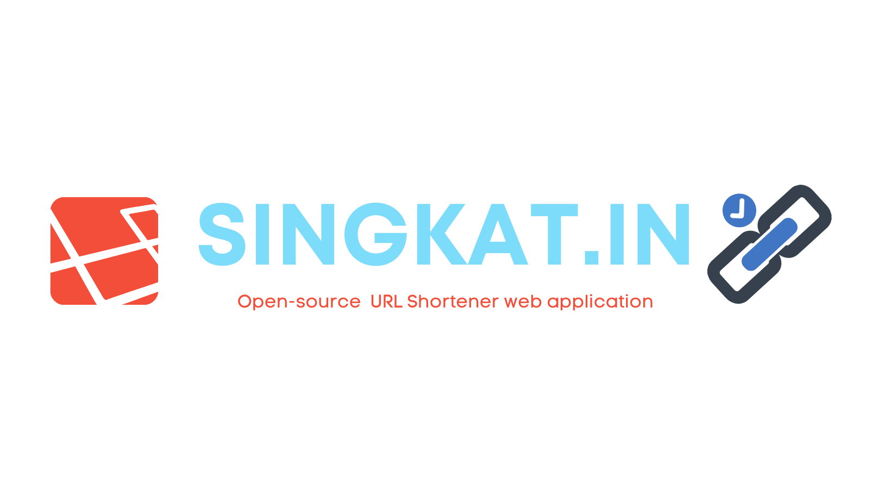
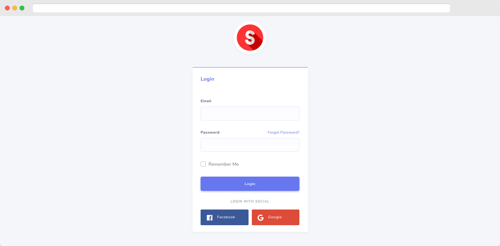
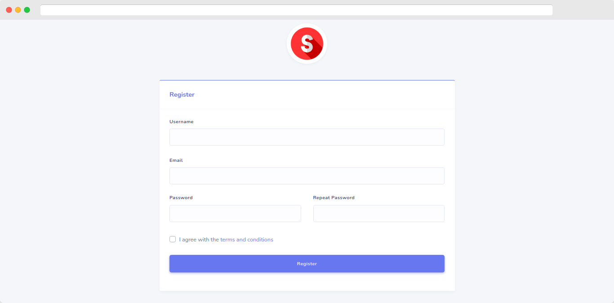
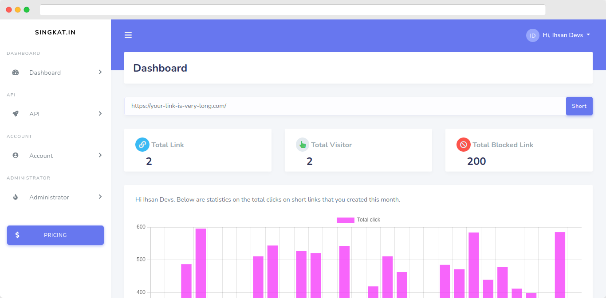
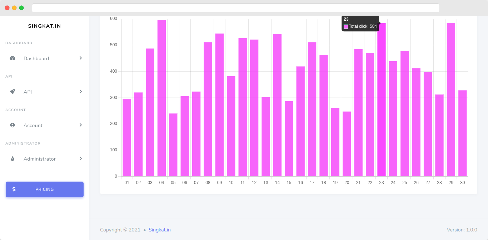
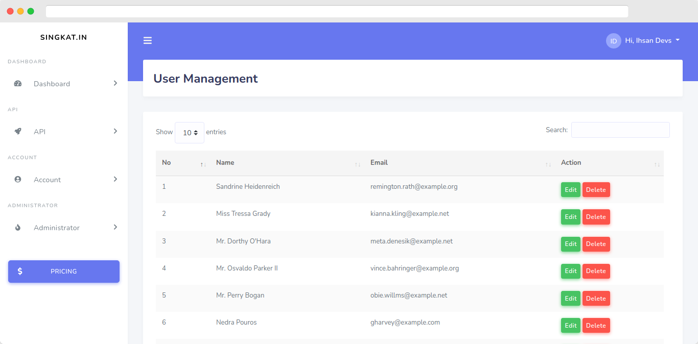

<div id="top"></div>

<br />
<div align="center">
  <a href="https://github.com/IhsanDevs/Singkat.in">
    
  </a>

  <h1 align="center">Singkat.in</h1>

  <p align="center">
    Aplikasi open-source URL Shortener berbasis laravel
    <br />
    <a href="https://github.com/IhsanDevs/Singkat.in"><strong>Explore the docs »</strong></a>
    <br />
    <br />
    <del><a href="#">View Demo</a></del>
    ·
    <a href="https://github.com/IhsanDevs/Singkat.in/issues">Report Bug</a>
    ·
    <a href="https://github.com/IhsanDevs/Singkat.in/issues">Request Feature</a>
  </p>
</div>

<!-- TABLE OF CONTENTS -->
<details>
  <summary>Table of Contents</summary>
  <ol>
    <li>
      <a href="#tentang-project-ini">Tentang Project Ini</a>
      <ul>
        <li><a href="#dibangun-dengan">Dibangun Dengan</a></li>
      </ul>
    </li>
    <li>
    <a href="#screenshot">Screenshot</a>
    </li>
    <li>
      <a href="#getting-started">Getting Started</a>
      <ul>
        <li><a href="#requirements">Requirements</a></li>
        <li><a href="#installation">Installation</a></li>
      </ul>
    </li>
    <li><a href="#usage">Usage</a></li>
    <li><a href="#feature">Feature</a></li>
    <li><a href="#kontribusi">Kontribusi</a></li>
    <li><a href="#license">License</a></li>
    <li><a href="#contact">Contact</a></li>
  </ol>
</details>

<!-- Tentang Project Ini -->

## Tentang Project Ini

**Singkat.in** adalah project web yang menyediakan layanan memotong URL. Project ini sedang dalam proses development.

<p align="right">(<a href="#top">back to top</a>)</p>

### Screenshot

<table>
  <tr>
    <td>
    </td>
    <td>
    </td>
   </tr>
   <tr>
    <td>
    
    </td>
        <td>
    
    </td>
   </tr>
      <tr>
    <td>
    
    </td>
        <td>
    
    </td>
   </tr>
</table>

### Dibangun Dengan

Framework serta package yang saya gunakan untuk membuat website ini antara lain:

-   [Stisla](https://github.com/stisla/stisla)
-   [Datatables](https://github.com/DataTables/DataTables)
-   [Laravel](https://laravel.com)
-   [Bootstrap](https://getbootstrap.com)
-   [JQuery](https://jquery.com)

<p align="right">(<a href="#top">back to top</a>)</p>

<!-- GETTING STARTED -->

## Getting Started

Silahkan ikuti petunjuk dibawah ini untuk menjalankan project ini.

### Requirements

Sebelum menjalankan aplikasi ini, silahkan dicek apakah daftar software pendukung dibawah ini sudah tersedia :

-   PHP
-   MySQL
-   GIT
-   Node JS
-   Composer

### Installation

1. Clone repo ini
    ```sh
    git clone https://github.com/IhsanDevs/Singkat.in.git
    ```
2. Copy paste environment
    ```sh
    cp .env.example .env
    ```
3. Install semua dependency composer
    ```sh
    composer install
    ```
4. Install semua dependency NPM
    ```sh
    npm install
    ```
    ```sh
    npm run dev
    ```
5. Konfigurasikan file `.env`.
6. Lakukan migrasi table.
    ```sh
    php artisan migrate
    ```
7. (Opsional) Lakukan database seeding untuk table user.
    ```sh
    php artisan db:seed
    ```
8. Jalankan aplikasi

    ````sh
     php artisan serve
     ```

    ````

<p align="right">(<a href="#top">back to top</a>)</p>
<!-- USAGE EXAMPLES -->

## Usage

Jika aplikasi sudah berjalan, tinggal buka url http://localhost:8000 pada web browser.

<p align="right">(<a href="#top">back to top</a>)</p>

<!-- FEATURE -->

## Feature

-   [x] Login
-   [x] Register
-   [x] Socialite Support
-   [x] Broadcast message menggunakan Pusher
-   [ ] Multi-language Support
    -   [x] Indonesia
    -   [ ] Inggris
-   [ ] Short URL Management
    -   [x] Count visitor
    -   [x] Count total short URL per user
    -   [ ] API Support
    -   [ ] Ban dan Unban short URL berbahaya (Ex. Link phishing, NSFW, Konten gore)
    -   [ ] Short URL Customization
-   [ ] Administator
    -   [x] Delete user
    -   [ ] Edit user
    -   [ ] Site setting

<p align="right">(<a href="#top">back to top</a>)</p>

<!-- kontribusi -->

## Kontribusi

Kegiatan kontribusi akan membuat komunitas open source menjadi tempat yang luar biasa untuk belajar, menginspirasi, dan berkreasi. Setiap kontribusi yang kamu buat pada project saya, saya sangat hargai.

Jika kamu memiliki saran yang akan membuat project ini lebih baik, silakan fork repo dan lakukan "pull request". Anda juga dapat membuka issue dengan tag "enhancement". Jangan lupa untuk memberi project ini bintang! Terima kasih!

<p align="right">(<a href="#top">back to top</a>)</p>

<!-- LICENSE -->

## License

Dibuat dibawah lisensi GPL. Lihat [`LICENSE`](assets/LICENSE.txt) untuk info lebih lanjut.

<p align="right">(<a href="#top">back to top</a>)</p>

<!-- CONTACT -->

## Contact

Ihsan Devs - [@IhsanDevs](https://twitter.com/IhsanDevs) - ihsan_devs@pm.me

Project Link: [https://github.com/IhsanDevs/Singkat.in](https://github.com/IhsanDevs/Singkat.in)

<p align="right">(<a href="#top">back to top</a>)</p>
